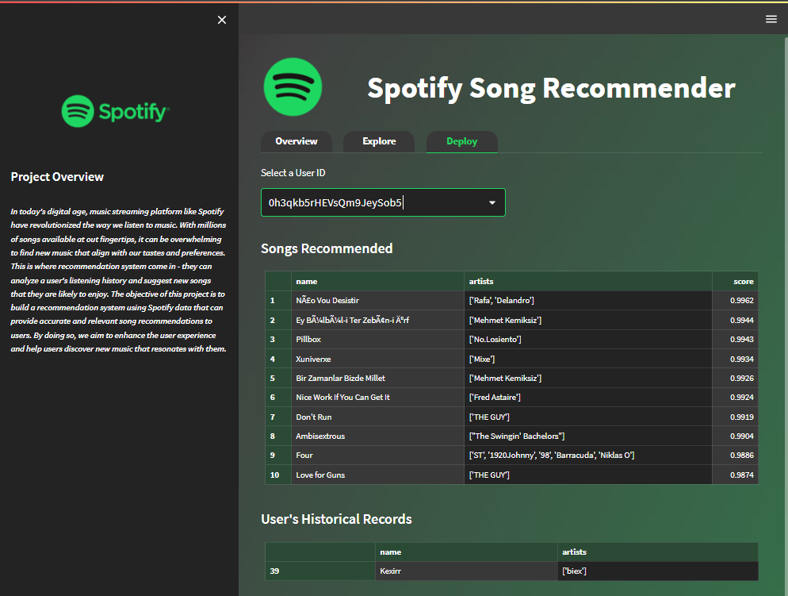

# SPOTIFY SONGS RECOMMENDER - STREAMLIT APPS

A project of collaborative filtering recommendation system, which using spotify dataset for this practice. 

### DESCRIPTION OF UPLOADED FILES

### "code" folder

- contained all the codes, dataset, and some images for streamlit app design

|File Name|Description|
|---------|-----------|
|bg2.jpg|Streamlit App's background image|
|main.py|The main code of this project (all in one file)|
|spotify.csv|The Spotify dataset|
|spotify-logo.png|The Spotify logo image used in main page|
|spotify-logo2.png|The Spotify logo image used in sidebar|

### "images" folder

- contained only the screenshot of each page created 

### THE APP

- this is the preview of the last page created which display the top 10 songs recommended for selected user, you may refer to "images" folder for other pages. 

Thank you for reading !!!
